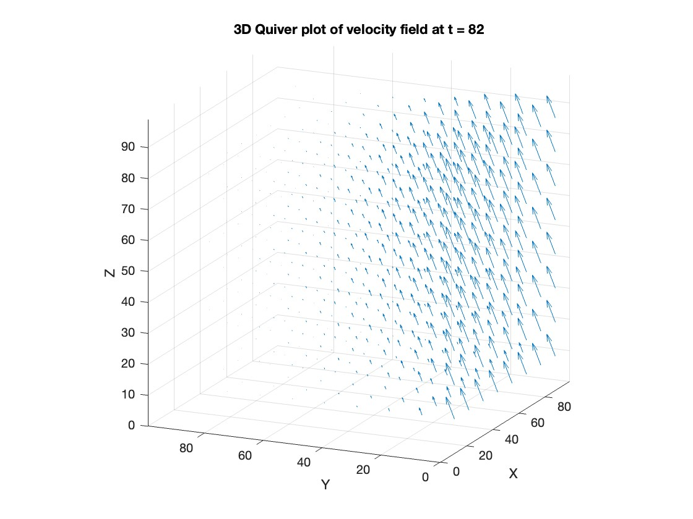
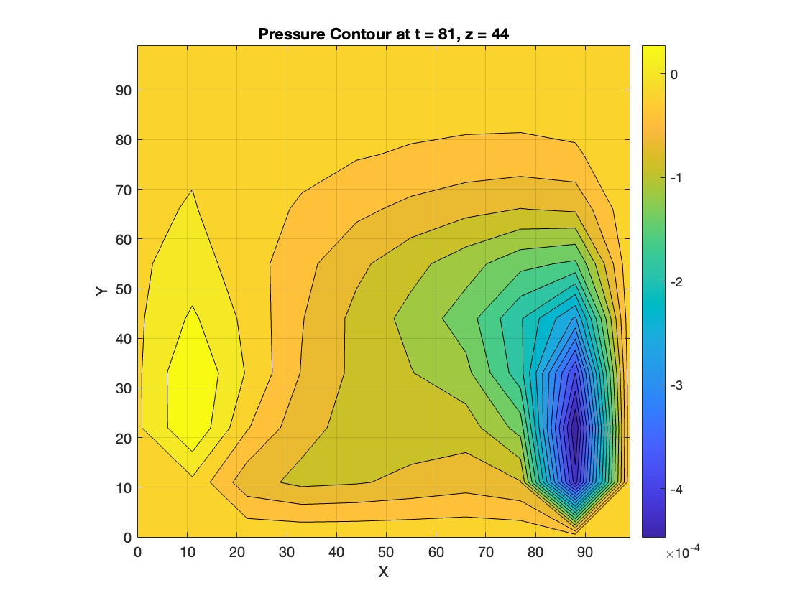

# 🌪️ 3D Navier-Stokes Solver

This project implements a 3D incompressible fluid dynamics solver from scratch using the Finite Difference Method (FDM) and the Artificial Compressibility Method (ACM).  
It builds on the work from my validated 2D Navier-Stokes Solver by extending the numerical scheme to three dimensions — introducing full spatial discretization, velocity field evolution, and pressure computation across a 3D grid.

This solver was not directly part of my Bachelor's thesis, but shares its mathematical and numerical foundation. It was developed in parallel as a standalone extension.

---

## 🔧 Features

- 3D lid-driven cavity flow simulation
- Finite Difference discretization in all three spatial dimensions
- Pressure-velocity coupling via the Artificial Compressibility Method
- Explicit Euler time-stepping
- Velocity field visualization via 3D quiver plot
- Pressure field sliced and rendered at selected z-levels
- Tunable domain size, grid resolution, and timestep

---

## 📊 Results

> Generated using a 100×100×100 grid and 80+ time steps.

### 🔹 Velocity Field (3D Quiver)

### 🔹 Pressure Slice at z = 44

---

## 🧠 Why It Matters

This project demonstrates the process of taking a fully working 2D simulation and extending it into 3D — a significantly more complex numerical and computational challenge.

It matters because:
- It shows the ability to build multi-dimensional numerical systems from scratch
- It involves careful handling of discretization, boundary conditions, and stability in 3D
- It lays the foundation for further development into GPU-accelerated solvers or browser-based real-time simulations using GLSL/WebGL

Unlike many high-level simulation tools, this solver exposes the full mechanics of the system — every equation, boundary, and update is implemented manually and transparently.

---

## 📘 Related Work

This 3D solver is built on top of the methods developed in my 2D solver project:  
🔗 [2D Navier-Stokes Solver on GitHub](https://github.com/luckypantss/2D-Navier-Stokes-Solver)  
📄 Thesis: *“Enabling Interactive Fluid Simulations”*  
[Download the PDF (256+ downloads)](https://ltu.diva-portal.org/smash/get/diva2:1884106/FULLTEXT01.pdf)

---

## 🖥️ How to Run

1. Open `src/main.m` in MATLAB
2. Adjust parameters (grid size, number of timesteps, etc.)
3. Run to simulate the flow and generate pressure/velocity plots

---

## 📁 Project Structure
src/ ├── main.m # Simulation runner ├── NSSolver.m # Core 3D solver logic ├── SpatialDisc.m # Grid and spatial discretization

results/ ├── 3DQuiverPlotN10.jpg # Velocity field (3D quiver) ├── PresureContourN10.jpg # Pressure contour at z = 44
